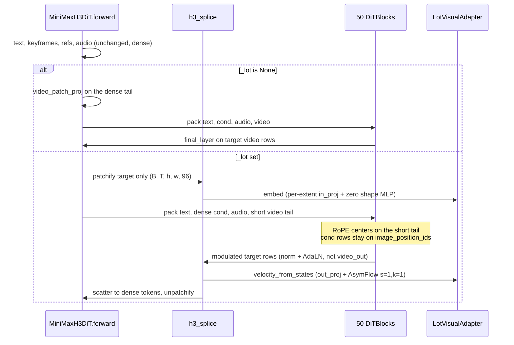
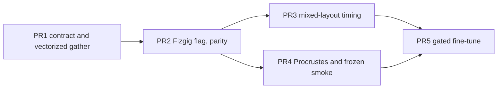

# Level-of-Token Compute Reduction on MiniMax-H3

| Field | Value |
| --- | --- |
| Author | TBD |
| Date | 2026-10-09 |
| Status | Draft |
| Branch context | `lot-progress` on the fork `johndpope/MiniMax-H3`. Do not open a PR against `MiniMax-AI/MiniMax-H3`. |
| Scope | Plan only. No training, no H3 weight load, no `torch.cuda.empty_cache`, no `scripts/scd`. |

## Overview

The Level-of-Token (LoT) port under `scripts/lot/` already implements Nakayama et al., arXiv:2610.05816: a partition of the uniform token lattice into axis-aligned rectangles, one shared timestep, extent scales on the clean latent, shape features, finest-grid centers, and LakonLab asymmetric-velocity recovery (`s = 1`, `k = 1`). The transformer is supposed to attend over the short rectangle list while the velocity written back stays full resolution.

That saving is not happening on H3. `LotBackbone` in `scripts/lot/train_synth.py` is a 2-layer, hidden-128, 4-head attention block over an 8×8 grid. A mixed layout of about 7 tokens cuts that toy's FLOPs by roughly 10× and still lands in the low millions of MACs. H3 is never called, so an H3 step costs the same as it did before the port existed.

This plan splices the existing `LotVisualAdapter` into the real 50-block DiT, replacing only the target-video tail. Text, audio, keyframes, and reference rows stay dense. The first number that counts is wall time and packed token count of one int8 H3 forward on a multi-frame clip, against the dense tail at the same canvas. Growing `LotBackbone` until its FLOP counter looks large is rejected below.

`docs/` and `scripts/lot/` are local research on this fork. They are not upstream mirror content and must not be described or pushed as such.

## Background and Motivation

### What the paper actually saves

The project page (https://georgenakayama.github.io/lotdiffusion/) measures the short sequence inside a large DiT, not a kernel that beats token merging.

- Video, 10 clips, matched token budget versus ToMe-SD and Foveated Diffusion: dense Wan2.1 is about 1096–1116 s. LoT is about 342–1022 s, 1.08×–3.26× versus dense, tracking 1.13×–2.74× token compression.
- Images: FLUX.2 at 4096 tokens has median 5.76 s. LoT-Flux2 median is 3.30 s at 651–3122 tokens.
- ToMe at the same budget is within a few percent of LoT. The win is the shorter sequence. It is not a faster merge kernel.

H3 will not reproduce those Wan or FLUX pictures. A frozen int8 base plus new heads only proves that the packed sequence got shorter. Quality training is a later, gated phase.

### What the local port already does

| Piece | Where | Contract |
| --- | --- | --- |
| Layout partition | `scripts/lot/layout.py` | Rectangles cover the uniform lattice exactly once. `LotLayout.compression` is dense cells divided by `count`. |
| Extent bank | `scripts/lot/adapter.py` `ExtentBank` | Frozen semi-orthonormal `A` (`AᵀA = I`), identity at 1×1×1. `fit_` replaces `A` and `s`. `fit_` alone does not rebuild heads. |
| Heads | `LotVisualAdapter.init_from_pretrained` | `W_in,e = W_in Aᵀ`, `W_e = A W_out`, biases lifted by `A`. Stored `pretrained_*` buffers. `fit_extent` refits `A` and rebuilds every head from those buffers. |
| Shape MLP | `adapter.py` | Eq. 11 features, last linear zero-initialized, so it adds nothing at init. |
| Flow | `scripts/lot/flow.py` | Loads `LakonLab/lakonlab/models/architectures/asymflow/common.py` by file path so `mmcv` is not imported. `recover_dense_velocity` calls `AsymFlowMixin.asymflow_velocity` with `s = 1`, `k = 1`. Per-extent timestep calibration (paper eq. 18) is not used. Extent scale is applied to the clean latent (eq. 16) so every token shares one timestep. |
| H3 geometry | `scripts/lot/h3.py` | Patch `(1, 2, 2)` on 24-channel latents, token dim 96, hidden 5376, 56 heads × 128. `H3_EXTENTS` is temporal extent 1 and spatial sides `{1, 2, 4}`, rectangles included (9 extents). `IMAGE_EXTENTS` adds 8×8 squares and is not the H3 set. `make_h3_adapter` does not load weights. |
| Positions | `scripts/lot/h3_positions.py` | Resamples LoT centers onto the H3 RoPE grid (spatial scale 32, time steps `5/3 * (1, 4, 4, 4, 4)`). Audio does not advance the video clock. Dense no-ref layouts match Fizgig `image_position_ids`. Keyframe and reference rows are not inserted yet. |
| Toy trainer | `scripts/lot/train_synth.py` | Defaults `--hidden 128 --layers 2 --heads 4 --grid 8 --token-dim 32`. Its extent list is five tuples, not `H3_EXTENTS`. `--save-every` defaults to 0 and then writes no checkpoint, including none on the way out. Checkpoints under `scripts/lot/runs/` are gitignored and are not H3 weights. |
| CPU sanity | `scripts/lot/sanity.py` | Six H3-legal rectangles on an 8×8 canvas, a full-canvas velocity, and a hard reject of an 8×8 square. `test_lot.py` calls it as `test_sanity_short_sequence_writes_nothing`. The suite is 13 tests. `python3 scripts/lot/sanity.py` prints `SANITY ok 2 tokens 6/64 macs 304128/4194304 writes=0`. That MAC line is `LotBackbone` at hidden 32. It is not the H3 gate. |

`gather_extent`, `scatter_extent`, and `apply_extent_scales` each walk rectangles in Python. On a real canvas that is thousands of kernel launches per forward. That loop will hide the attention win if it is still there when H3 is timed.

### The DiT this plan splices

The runnable forward is not in this Hugging Face mirror. It is Fizgig's `MiniMaxH3DiT` in `/media/2TB/Fizgig/src/fizgig/minimax/model.py`.

Confirmed from that file and from `FL2VA/transformer/config.json`:

- Batch size is hard-checked at 1 (`forward` raises otherwise).
- Pack order is `[text | keyframes | refs | audio | target video]`.
- `video_patch_proj` is `nn.Linear(96, 5376)`. `video_patch_dim = 24 * 1 * 2 * 2 = 96`.
- Fifty `DiTBlock`s. `Attention.qkv_proj` is `Linear(5376, 7168 * 3)` with no bias. `out_proj` is `Linear(7168, 5376)`. `MLP.fc1` is `Linear(5376, 14336 * 2)` (SwiGLU). `fc2` is `Linear(14336, 5376)`. Inner width `56 * 128 = 7168`.
- `FinalLayer` is `RMSNorm`, then an AdaLN shift/scale (`AdalnProj` with `expand = 2`, `modalities = 1`), then `video_out = Linear(5376, 96)` and a separate `audio_out = Linear(5376, 32)`. The norm and AdaLN are outside the linear the LoT output head is allowed to replace.
- RoPE is split-half over `image_position_ids` `(t, h, w)`, 16 frequencies per axis, spatial axis scaled by 32.
- Condition rows (keyframes, references) are patchified with the same `video_patch_proj`, tagged video, pinned near clean (`VISUAL_COND_TIMESTEP = 0.999`), and are not denoised. They are not the sequence being shortened.
- Audio rows are always packed when `pack_audio_rows` is true. A still is 4 rows. Sigma is remapped from video shift 12 to audio shift 3 inside `forward`. LoT does not change that remap.
- `enable_block_swap` / `_h2d_offloader` (`H3Int8H2DOffloader`) stream int8 ConvRot blocks. At least two blocks stay resident. Ring default is 2. One streamed block's int8 payload is 0.385 GB (`qkv + out + fc1 + fc2` parameter count, 1 byte each).
- TREAD (`dit._tread`, training only, grad enabled, `latent_t > 1`) drops a random subset of existing 1×1 video rows between two blocks and rejoins them unchanged. It does not pool patches and it does not change the output head.

Diffusers is the other consumer, not the first splice. `MiniMaxH3Transformer3DModel.forward` in `diffusers/models/transformers/transformer_minimax_h3.py` takes rows that are already packed (`hidden_states`, `audio_hidden_states`, `encoder_hidden_states`, index tensors). `before_denoise.py` `patchify_video_latents` and `MiniMaxH3PrepareLayoutStep.build_packed_sequence` use the same t2va/fl2va order: text, keyframe conditions, target audio, target video. There is no int8 H2D ring on that class. Names differ (`proj_in` / `proj_out` / `context_embedder` / `norm_out` / `transformer_blocks`). The full bf16 Hub checkpoint does not fit this GPU. The loader comment in Fizgig puts that file at about 66 GB.

### Machine and checkpoint inventory

One GPU: NVIDIA RTX PRO 4000 Blackwell, index 0, 24467 MiB, 24 GB GDDR7, 672 GB/s, PCIe 5.0 x16, 145 W. Published compute is 40 TFLOPS FP32. BF16 tensor throughput is not published. Do not plan a second GPU. Full bf16 H3 does not fit. Qwen3-VL-32B does not fit. Text rows are precached embeddings. Do not plan to load Qwen.

Directory listing on 2026-10-09, weights not loaded into a model:

- Present, 20970379616 bytes: `/media/2TB/Fizgig/models/diffusion_models/minimax_h3_fl2va_pruned_int8_convrot.safetensors`.
- The same file via symlink: `/media/2TB/Fizgig/models/minimax_h3_fl2va_pruned_int8_convrot.safetensors`.
- Not on disk under `/media/2TB/Fizgig/models`: `minimax_h3_distilled_8step_int8_convrot.safetensors`. That name is an earlier note, not a second checkpoint.

The safetensors header's first key is `adaln_t_table`, float32, shape `[1025, 8]`. Fizgig `config_from_checkpoint` (`loader.py`) therefore builds `MiniMaxH3Config(adaln_t_table_size=1025, time_embed_dim=8)` with `apply_silu=False` on AdaLN. `FL2VA/transformer/config.json` still says `time_embed_dim: 2688` and describes the unpruned release. Constructing `MiniMaxH3DiT()` with the mirror's defaults and then loading this file is the wrong model. The gated load is `load_minimax_h3_dit(path, base_quant="int8", ...)` so the config comes from the file.

`load_minimax_h3_dit` imports bitsandbytes at entry even on the int8 path. Int8 mode keeps ConvRot linears for keys that carry `comfy_quant`. The token refiner, AdaLN projections, and the I/O linears load dense. Fizgig's measured int8 residency with nothing streamed is about 21 GB (`_RESIDENT_INT8_GB`). That plus a multi-frame activation does not fit in 24467 MiB, so the first forward streams blocks. It does not decode the base to bf16.

The day-long toy run has already stopped. PID 2294849 is gone. `scripts/lot/runs/day/pid` still contains `2294846`, and that pid is gone too. `nvidia-smi` shows no `train_synth` process. The card has 22555 MiB free of 24467 MiB, desktop use only. The day log's last row is historical: step 1399850, held-out eval 0.220. `last.pt` is a leftover of the lot-day workflow, which passes `--save-every 200` on the probe and `--save-every 2000` on the train. A default `train_synth.py` invocation does not refresh it. It is not evidence of a live process, and it is not an H3 initialization.

A GPU test gates on a live process (`nvidia-smi` has no `train_synth`, or `kill -0` fails on a pid the operator names). The pid file existing is not a skip. The test does not kill anything and does not call `torch.cuda.empty_cache`.

Disk and host memory, checked with the card in that state: the Fizgig volume (`/media/2TB`, also mounted at `/run/media/johndpope/2TB`) has about 62 GB free and is 97% full. Host RAM has about 81 GiB available, `/tmp` is a 46 GB tmpfs, and swap is 8 GB. The unpruned bf16 transformer index is `total_size` 66280430080 (66.3 GB) and does not fit on that volume. This plan does not download it. It also does not write an activation cache beside the 20 GB int8 file. The H2D ring's pinned flats, about 32 × 0.42 GB ≈ 13 GB, do fit in RAM.

### GEMM cost, confirmed

The 385.4M MAC figure in `docs/MINIMAX_H3_SCD_PORT_DESIGN.md` matches the Fizgig constructors. It is GEMMs only. RMSNorm, RoPE, and SwiGLU's elementwise product are omitted on purpose.

Per token, per `DiTBlock`:

| GEMM | Shape | MACs |
| --- | --- | --- |
| `attn.qkv_proj` | 5376 → 21504 | 115,605,504 |
| `attn.out_proj` | 7168 → 5376 | 38,535,168 |
| `mlp.fc1` | 5376 → 28672 | 154,140,672 |
| `mlp.fc2` | 14336 → 5376 | 77,070,336 |
| **Linear total** | | **385,351,680** |

Attention MACs per token per layer are `2 * S * 7168` (QKᵀ and AV). The linear and attention terms cross at `385,351,680 / (2 * 7168) = 26,880` packed tokens. Below that, shortening the sequence saves mostly the linear term and wall time tracks token count. Above that, attention is the larger term and the MAC ratio beats the token ratio. The token refiner is two dense blocks on the text rows only. At a few hundred text tokens it is under a tenth of a percent of a 38k-token, 50-layer step and is left out of the table.

`ConvRotInt8Linear` does not materialize a true-basis weight. The eager path, which is what parity and timing take, casts the int8 codes with `qdata.to(dtype)` and applies `wscale` to the output (`convrot.py`, `_Int8RotLinearFn.forward`). The fused W8A16 kernel is training-only: `_use_w8a16` requires `needs_input_grad` on the input, so a no-grad forward stays on the eager cast. The cast of `fc1` is `5376 * 28672 * 2 = 308 MB` of bf16. Budget that cast, and keep `_INT8_TRANSIENT_GB = 1` for a handful of live casts. Do not also reserve a second 308 MB true-basis copy. The function exists to avoid that second tensor. Summing a bf16 copy of every block linear is about 38.5 GB of traffic if they were live together. They are not. That number is an upper bound, not an allocation. At `S = 38222` the step is still compute-bound either way.

## Goals and Non-Goals

### Goals

1. Keep the paper's video setup: temporal extent 1, spatial sides `{1, 2, 4}`, rectangles allowed, mixed sizes inside one canvas, full-resolution velocity, one shared timestep, extent scale on the clean latent, no per-extent timestep calibration.
2. Make a dense 1×1×1 layout a parity gate against today's Fizgig forward: same `video_latent`, same explicit `audio_rows`, same bf16 text, same `t`, same packed length, unpatchified velocity within the floor rule in the parity section. That gate is not a speedup.
3. Vectorize gather, scatter, and extent scaling per extent before any H3 timing.
4. Time one mixed-layout forward against the dense tail on a clip where video tokens are most of the pack. Report tokens, milliseconds, and peak MB.
5. After that, and only with aligned pairs the user supplies, Procrustes-fit `A` and `s`, rebuild heads, and smoke a frozen base.
6. Leave fine-tuning last and gated, and only on the 384×640 × 7-latent-frame clip. Extent linears, the already-zero shape MLP, then LoRA on block linears. Batch 1, gradient checkpointing, precached bf16 text, int8 streaming. The 37-frame timing clip is not a training example. No bf16 load of the base.

### Non-goals

- Separable Causal Diffusion, anything under `scripts/scd`, and the VFM flywheel.
- Loading Qwen3-VL-32B, or running the text encoder in the same process as the DiT.
- NVFP4, a second GPU, or `torch.cuda.empty_cache`.
- Pushing to `MiniMax-AI/MiniMax-H3`, or treating this plan as upstream mirror content.
- Reproducing FLUX.2 or Wan2.1 samples, or matching the website's pictures with a frozen base.
- Killing any process to free the GPU. The day run is already gone. Do not initialize H3 from `scripts/lot/runs/day/last.pt`.
- Writing a multi-step block cache, or a per-block `h` or `fc1` dump, for the timing clip. See the memory section.
- Implementing ToMe, foveated diffusion, or a website code release. There is no LoT reference implementation in this repo.
- Stacking LoT on TREAD.
- Using `IMAGE_EXTENTS` (the 8×8 square) on the H3 video path.
- Per-extent timestep calibration.

## Proposed Design

### Invariants the splice is not allowed to break

- The uniform lattice is partitioned. Every finest cell is in exactly one rectangle. `validate_layout` already enforces that.
- The output canvas stays full resolution. `unpatchify_video` still returns `[1, 24, T, H, W]`.
- Coarse tokens do not get their own timestep. `s` in the bank scales the clean latent. `AsymFlowCalibration.k` stays 1.
- Unit extents sit on the integer RoPE lattice the pretrained model already uses. Coarse tokens sit at the rectangle center, linearly sampled on that same axis (`h3_positions.sample_axis`).
- Condition rows stay dense, pinned near clean, and keep `video_patch_proj`. They are not passed through extent heads.
- Audio keeps `audio_patch_proj` and `final_layer.forward_audio`.
- Text keeps `condition_proj` and, when the cache is still 5120-wide, the two-layer `token_refiner`. A cache that is already 5376-wide skips the refiner, which is Fizgig's existing rule. Parity uses the same tensor on both paths.
- `_tread` and `_lot` together raise. TREAD's `keep_idx` is computed from the dense video length and rejoins rows that LoT has already replaced.

`AsymFlowMixin.asymflow_velocity` with `s = 1`, `k = 1` is the identity when `A` is full rank, because the orthogonal complement is zero and the subspace term copies `u_a`. A dense 1×1 layout with the mean-lift identity therefore returns the head output unchanged, for any sigma. That is why the parity gate can pass while a swapped sigma still ships. Coarse extents are not the identity: the complement is `(x_t_complement + u_a_complement) / sigma`. The splice must pass the noise level, which in Fizgig is `sigma = (1 - t).clamp(0, 1)`, not the cleanness `t` fed to the time embedder. Dense parity will not catch the swap. A coarse contract test will.

Until `fit_extent` runs, every `s` buffer is 1, so y-space and the pretrained latent are the same point. Phases 1–3 keep that. After a Procrustes fit, scales move and a frozen base is off the distribution it was trained on. Phase 4 is a smoke that the short sequence still runs. It is not a picture match.

### Why the output head is not `init_from_pretrained` of `final_layer`

`init_from_pretrained` matches a plain `nn.Linear`: `weight_in` is `(hidden, 96)`, `weight_out` is `(96, hidden)`. That is `video_patch_proj.weight` and `final_layer.video_out.weight`, including bias. It is not `FinalLayer.forward`.

Stock video tail:

```text
hv = RMSNorm(h) * (1 + scale[video_t_index]) + shift[video_t_index]
v  = video_out(hv)
```

The extent linear replaces `video_out` only. Norm and AdaLN stay the shared `final_layer` modules, including the pruned curve table (`time_embed_dim = 8`, no SiLU). Applying `out_proj` to the block residual, or folding the norm into `W_e`, fails parity even at 1×1. `velocity_from_states` already applies `out_proj` and then eq. 9. The splice calls `embed` before the blocks and `velocity_from_states` on the modulated video rows. It does not call `LotVisualAdapter.forward`, because that helper assumes the backbone returns the states the head should read, with no AdaLN in between.

The header dtype island, not the mirror config, is what the splice copies:

| Tensor | Header dtype and shape |
| --- | --- |
| `video_patch_proj.weight` | F32 `[5376, 96]` |
| `final_layer.video_out.weight` | F32 `[96, 5376]` |
| `audio_patch_proj` | F32 |
| `condition_proj` | BF16 |
| Block linears (`qkv`, `out`, `fc1`, `fc2`) | I8 ConvRot |
| Block `adaln_proj.linear.weight` | F16 `[96768, 8]` |
| `adaln_t_table` | F32 `[1025, 8]` |

`init_from_pretrained` copies into the `nn.Linear`'s current dtype. It does not adopt the checkpoint dtype. The adapter is constructed in float32, then initialized from those F32 tensors, and the extent linears are not cast to bf16. The forward casts the patch into the weight dtype and the result back to the activation dtype, which is what `video_patch_proj` and `video_out` already do. `condition_proj` and the block AdaLN weights are not extent heads. A silent bf16 copy of `video_out` is a parity failure, not an optimization.

`forward` sets `dtype = text_embeds.dtype` and casts the packed sequence to it. The activation sizes below are bf16. An fp32 text cache doubles them. `LOT_TEXT_EMBEDS` is bf16 or the bench rejects it. The `LOT_H3` record prints that dtype.

The shape MLP's last layer stays zero at init, so `embed` at 1×1 equals `video_patch_proj` and nothing else.

### Splice, flag default off

Add `MiniMaxH3DiT._lot = None`. `None` is today's `forward`, byte for byte, and it does not import `scripts/lot`. Setting it installs a small spec:

```python
@dataclass
class LotSplice:
    adapter: LotVisualAdapter          # H3_TOKEN_DIM, H3_HIDDEN, H3_EXTENTS
    layout: LotLayout                  # et == 1, extents subset of H3_EXTENTS
    # positions for the whole pack are built beside the layout, not stored here
```

The math lives in `scripts/lot/h3_splice.py`. Fizgig has no import path to that module. `test_lot.py` inserts `/media/2TB/Fizgig/src` onto `sys.path` in the other direction, and nothing is installed. The flag branch owns the import, and only when `_lot is not None`:

```python
def _load_lot_splice():
    import os, sys
    root = os.environ.get(
        "LOT_ROOT",
        "/home/johndpope/Documents/GitHub/MiniMax-H3/scripts/lot",
    )
    if root not in sys.path:
        sys.path.insert(0, root)
    import h3_splice  # this checkout, not an installed package
    return h3_splice
```

`_lot is None` never calls that helper, so a normal Fizgig process does not import LakonLab and does not need `LOT_ROOT`. A failed import raises with the path it tried. Do not vendor `scripts/lot` into Fizgig. Do not import `scripts/scd`. `h3_splice.py` does not import `fizgig` at module level. The parity test may import both.



Pack indices when the flag is on:

- `n_video` becomes `layout.count`, not `latent_t * (H/2) * (W/2)`.
- `video_start` is still `text_len + n_cond + n_audio`. Condition and audio lengths do not change.
- `mod_row` for the short tail stays `VIDEO_TAG` at the video timestep index. One shared video timestep. No new AdaLN rows.
- `image_position_ids` is no longer correct for the video segment. The prefix (text, keyframes, refs, audio) must match it. The video segment comes from `video_positions` on the LoT centers. `h3_positions.packed_positions` today builds text, then audio, then video, and documents that keyframes and refs are absent. Phase 1 extends it so a call with keyframes and refs matches `image_position_ids` exactly, including the rule that only reference blocks advance the media cursor. Diffusers' fl2va anchor (first keyframe at `text_len`, last at `text_len + span - 5/3`) matches Fizgig when there are no refs. The Fizgig function is the one the parity test imports.

`patchify` in `scripts/lot/h3.py` and Fizgig `patchify_video` use the same channel order: `C`, then `pt`, `ph`, `pw` with `pw` fastest. A contract test flattens `h3.patchify` and compares it to `patchify_video` on a tiny latent. No weights.

TREAD's block loop indexes `h`, `cos`, `sin`, and `mod_row` together. The LoT branch refuses if `_tread` is set, before any block runs. It does not try to translate `keep_idx`.

`forward_cached` stays out of scope, and the raise when `_lot` is set stays. Removing it, or passing `new_cache`, parks every block input on CPU. Fizgig sizes a 22-frame 768² clip at about 46 MB per block, 50 blocks × 6 steps ≈ 11.6 GB. This gate clip is `S = 38222`: one block input is `38222 × 5376 × 2 = 410,962,944` bytes (411 MB), 50 blocks is 19.1 GiB, and six steps is 115 GiB. Retaining every block's `fc1` output for one step is about 102 GiB. None of that fits in 81 GiB of RAM, the 46 GB `/tmp` tmpfs, 8 GB of swap, or the 62 GB free on `/media/2TB`. The timing and parity forwards call `forward` only. They retain no block inputs, write no activation file, and do not dump `h` or `fc1`. A short tail would also invalidate the cache. That is a second reason for the raise, not the one that protects the disk.

### Vectorized gather before any timing

`gather_extent` stacks one slice per rectangle. At 17k rectangles that is 17k launches, and it runs twice a forward (embed and scatter). Replace the per-rect walk with one index per extent. Rectangles in a group share `(et, eh, ew)`, which is what `LotLayout.groups` already buckets.

```python
def gather_extent(tokens, rects):
    # tokens: (B, T, H, W, D). One advanced-index gather for the whole group.
    # Site order stays C-order (et, eh, ew, D), pw-equivalent channel fastest,
    # because Procrustes rows and scatter_extent use that order.
    ...
```

`scatter_extent` becomes one `index_put` per extent. `apply_extent_scales` stays a divide by `s` on the way in and a multiply only when `invert=True`. A vectorized "masked multiply" would match the Python loop at `s = 1`, which is every phase 1–3 run, and would be wrong the first time phase 4 fits a real scale. The CPU test compares gather, scatter, and scale against the loops on a mixed layout of all nine `H3_EXTENTS`, including a 1×2 and a 2×4, and it compares scale at a value other than 1 in both directions. Phases 2 and 3 do not time H3 until that test is green. The H3 forwards in those phases still pass `s = 1`.

Nine groups, not one kernel for the whole canvas, is enough. Extents are not the same shape, so a single gather would pad. Nine launches do not hide a 50-layer attention.

### Positions, including the keyframe and reference gap

`packed_positions` grows optional `keyframes` and `refs`, with the same meaning as `image_position_ids`:

- Keyframe rows sit after text and before refs in the sequence. Their clock is the target origin (after refs), plus `FRAME_RESCALE * frame_index`. They do not advance the cursor.
- Each image reference contributes its own frame grid at the cursor and advances the cursor by 1. A video-kind reference `(h, w, t)` with `t > 1` uses `_video_t_grid` and advances by the sum of spans. The target and the audio block both start at that cursor.
- Audio `w` stays pinned to the target width axis, channel 0 at the first sample and channel 1 at the last. Audio does not advance the video clock.
- A LoT video row with `et != 1` raises. H3 video extents are temporal-1.
- A 1×1 center samples the axis at an integer and must match the dense grid bit-for-bit in float64. The existing test covers the no-ref case. The new test covers one keyframe plus one image ref, and one video-kind ref, by importing `image_position_ids`. It does not load a checkpoint.

Condition rows are a documented gap in the sequence, not a gap in the lattice. The layout object describes only the target lattice.

### Concrete first clip

Released t2va canvas, from `resolve_canvas_size(16, 9, canvas_multiple=32, short_edge=768, max_pixels=768*1344)` in diffusers `modular_pipeline.py`: **768 × 1344** pixels. Latent spatial compression is 16, so the latent is **48 × 84**. The patch is 2×2, so the token grid is **24 × 42 = 1008 tokens per latent frame**.

Shortest on-distribution duration is 5 s at 24 fps, 120 pixel frames. The round-up to **124** (`17 * 7 + 5`) is `diffusers.modular_pipelines.minimax_h3.modular_pipeline.align_num_frames(120, 17, 5)`. `video_latent_num_frames` then returns **37** (`5 * 7 + 2`). `resolve_canvas_size(16, 9, canvas_multiple=32, short_edge=768, max_pixels=768*1344)` returns `(768, 1344)`. Fizgig's `latent_frames_for_pixels` snaps the other way (`align_num_frames_down`): 120 pixel frames become 107 and 32 latent frames, which is under the 26,880 crossover. The bench runs on Fizgig, so it passes `latent_t=37` and the audio length for `pixel_frames_for_latent(37) = 124`. It does not pass 120 pixel frames through Fizgig's snap-down. Audio is `round(124 / 24 * 40) = 207` latents × 2 channels = **414** rows.

Planning text length is **512** precached rows, text modality only, no `<Picture i>` vision block. The timing binary prints the real `L` and does not hard-fail on 512. Vision tokens inside the text prefix are video-tagged and stay dense. They dilute the speedup and are not part of this clip.

| | Dense | Mixed layout below |
| --- | --- | --- |
| Target video tokens | 37 × 1008 = **37,296** | 37 × 462 = **17,094** |
| Audio rows | 414 | 414 |
| Text rows | 512 | 512 |
| Packed `S` | **38,222** | **18,020** |
| Video share of the pack | 97.6% | 94.9% |
| Video-token compression | 1 | **2.182×** |
| Packed compression | 1 | **2.121×** |

The mixed layout is the same three bands on every latent frame, temporal extent 1, built with `layout_from_rects` (not the square quadtree):

- Token rows `[0, 8)`: 1×1. 8 × 42 = 336 tokens.
- Token rows `[8, 16)`: 2×2. 4 × 21 = 84 tokens.
- Token rows `[16, 24)`: 4×2 rectangles. 2 × 21 = 42 tokens.

462 tokens per frame. Extents used are `(1,1,1)`, `(1,2,2)`, `(1,4,2)`, all inside `H3_EXTENTS`. More than one extent is present, and it is not a uniform tiling. Width 42 is not divisible by 4, so `(1,4,4)`, `(1,2,4)`, and `(1,1,4)` do not tile this canvas, and `layout_from_detail(..., root=4)` rejects it (`width % root != 0`). A 4-wide token is legal on a different canvas. It is not this clip. VRS in `layout_from_vrs` only coarsens squares. It cannot emit the 4×2 band. The timing layout is hand-specified rectangles.

MAC estimate for one forward, 50 layers, text and audio included, GEMMs plus attention only:

| | Attention MACs | Linear MACs | Total MACs | Attention share |
| --- | --- | --- | --- | --- |
| Dense `S = 38222` | 2.094×10¹³ per layer | 1.473×10¹³ per layer | **1.784×10¹⁵** | 58.7% |
| LoT `S = 18020` | 4.655×10¹² per layer | 6.944×10¹² per layer | **5.800×10¹⁴** | 40.1% |

MAC ratio **3.08×** at **2.12×** packed compression. Attention is past the 26,880 crossover, which is why the MAC ratio beats the token ratio. That is the clip whose wall time is allowed to count.

Published FP32 is 40 TFLOPS and BF16 is unpublished, so a seconds estimate is a range, not a target. 1.784×10¹⁵ MACs is 3.57×10¹⁵ FLOPs. At an effective 40 TFLOP/s the dense forward is on the order of 90 s. At 100 TFLOP/s it is on the order of 36 s. The LoT forward is the same range divided by about 3.1 if the step is compute-bound. The eager int8 path casts codes per GEMM and drops them. It does not sit on 38.5 GB of bf16 weights. Streaming 32 int8 blocks is about 12.3 GB of H2D payload. On PCIe 5 x16 that is a few tenths of a second if it is not overlapped, and less if the ring prefetches. That is small next to a tens-of-seconds forward, and it dominates a tiny parity canvas. Parity is not timed as a speedup. The three timed forwards are the same `video_latent` and the same explicit `audio_rows`. Timing does not require those two launches to match bitwise.

Success band on this clip, median of three synchronized forwards after one discarded warmup: packed tokens match the table for the real text length (recompute `S` if `L ≠ 512`), and median wall time improves by at least **1.5×** and not more than the MAC ratio plus 10%. Under 1.5× means gather or H2D overhead ate the win. Profile those before any training. Do not compare against ToMe. The baseline is the dense tail in the same process, same noise, same `t`, same text tensor, flag off versus flag on.

When the video tail does not dominate, the speedup is supposed to be small. Same canvas, one still (`latent_t = 1`, 1008 video tokens, 4 audio rows), with the same band layout (462 video tokens):

| Text rows | Packed dense | Packed LoT | MAC ratio | Video share |
| --- | --- | --- | --- | --- |
| 128 | 1,140 | 594 | 1.96× | 88% |
| 512 | 1,524 | 978 | 1.59× | 66% |
| 4096 | 5,108 | 4,562 | 1.14× | 20% |

A long prompt, or a fl2va text stream full of vision tokens, on a single frame is the case the website's "tracking compression" line predicts will barely move. It is not the acceptance test.

fl2va on the 124-frame clip adds two dense keyframe frames (2 × 1008 = 2016 rows) that LoT does not shorten. Packed dense 40,238, packed LoT 20,036, MAC ratio about 2.87×, target-video share still 93%. Report it as a second line in the same timing PR. Do not make it the gate. The gate is t2va, where the shortened tail is the whole video segment.

Fallback if the 37-frame forward OOMs under streaming: 22 pixel frames, which Fizgig's preview clamp already uses on this card class. That is 7 latent frames, 7,056 dense video tokens, 74 audio rows. With 512 text rows, packed dense 7,642 and packed LoT 3,820 (same bands), MAC ratio about 2.25×, attention share only about 22% because `S` is under the crossover. Record it as a fallback. It is not the crossover result.

### Memory plan for that forward

The card, as it sits with the toy run gone, has 22555 MiB free of 24467 MiB (22.0 GiB). Plan a single forward against that, not against a cache.

Live activations at `S = 38222`, **bf16**, if the block holds them one at a time and then drops them:

- `fc1` output: 2.19 GB (decimal) / 2.04 GiB.
- `qkv` output: 1.64 GB.
- Residual stream: 0.41 GB. One block input is 411 MB. Fifty of those, retained, are 19.1 GiB.

Peak of one forward is on the order of 4 GB if SDPA does not materialize `S × S`. Math SDPA at this length is `S² * heads * 2` bytes, about 160 GB. It will not run. Timing sets the SDPA backend to flash or mem-efficient and aborts on a math fallback. Blackwell can run mem-efficient SDPA. Parity is a small canvas, so it may use the math backend to tighten the noise floor. That choice is not legal on the 37-frame clip. Do not turn on `set_int8_attention` for the parity gate. That kernel is a different matmul (about 1.6% relative error per call in Fizgig's notes). It may be a later timing ablation, reported separately, never as the parity baseline.

Streaming: call `load_minimax_h3_dit` with `blocks_to_swap=32` so the tail is never fully resident during load, then `enable_block_swap(32, h2d_only=True)`. That drops about 32 × 0.385 GB of int8 codes off the card and puts a ring of two flats back (about 0.77 GB). Weights left on GPU are on the order of 21 − 12.3 + 0.77 ≈ 9.5 GB, plus about 4 GB of bf16 activations and about 1 GB of int8-cast transient. About 14.5 GB. That fits in the 22555 MiB now free, with several GB left, and it writes nothing to the 2TB volume. An fp32 text tensor doubles the activation term and can erase the margin. Norms and AdaLN stay resident (Fizgig sizes them at about 1.7 MB per block). If the measured peak still has 3 GB free, a later run may lower the swap count. The first run does not start at zero swap.

What does not fit, and must not be built:

| Object | Size | Where it would have to live |
| --- | --- | --- |
| 50 block inputs, one step | 19.1 GiB | RAM or the 2TB volume |
| Those inputs × 6 steps (`forward_cached`'s preview depth) | 115 GiB | Neither RAM (81 GiB), `/tmp` (46 GB), swap (8 GB), nor the volume (62 GB free) |
| 50 `fc1` outputs, one step | ~102 GiB | Same |
| Unpruned bf16 transformer | 66.3 GB | The volume, which cannot take it next to the int8 file |

`forward_cached` is how Fizgig parks block inputs. The LoT flag raises there. Do not add a debug dump of per-block `h` or `fc1` for this clip.

No gradient on the parity or timing forward. Gradient checkpointing does not make the 37-frame clip a legal training example. See phase 5. Do not call `empty_cache` between the dense and LoT timings. Reset the peak counter with `torch.cuda.reset_peak_memory_stats` only.

### Parity gate

Small canvas, not the timing clip. Latent `[1, 24, 2, 32, 32]` is enough: token grid 2 × 16 × 16 = 512 video tokens, plus a non-zero text length and a non-zero audio block, plus a second case with one keyframe. Dense `LotLayout` only. Extent linears are the float32 copies of `video_patch_proj` and `video_out` described above. Text rows are bf16.

The compare is closed only if both calls see the same tensors. `forward` draws a fresh audio tensor whenever `audio_rows` is omitted (`torch.randn`, no generator). `seed` reseeds condition-frame noise only. Video tokens attend to the audio rows, so two calls at the same `t` and the same video latent do not match. Pass one `video_latent` and one `audio_rows` of shape `(n_audio_latents * 2, 32)` into both calls. `audio_rows` is used verbatim. `audio_noise` is not a substitute: it is scaled by `sigma_a`, and if it is also omitted the draw is fresh. The keyframe case passes the same `seed` and the same keyframe latents as well.

Flash and mem-efficient SDPA are not bitwise deterministic across two launches. Dense 1×1 recovery is the identity for any sigma, so this compare is the only check that the tail was replaced by the same linear, and a kernel that jitters will fail a correct splice. Before flag-on versus flag-off, run two flag-off forwards on those same tensors and record `rel_rms_floor`.

- Pass when `rel_rms(on, off) ≤ max(1×10⁻⁴, 2 * rel_rms_floor)` and max abs ≤ **1×10⁻²**.
- Keep 1×10⁻⁴ as the bar only when the floor is below it.
- If the floor itself is above 1×10⁻³, the compare is inconclusive. That is kernel noise, not a splice bug.
- A gap above 1×10⁻³ that is also well above the floor is a splice bug. Do not declare one until both controls exist: shared `audio_rows` and `video_latent`, and a measured floor.
- Do not quietly retarget the written bar past 1×10⁻³ to make a red run green.
- Audio velocity, if `return_audio`, uses the same rule. The flag does not touch the audio head.
- Packed length equals the dense length. `video_start` matches.

On this small canvas the math SDPA backend is legal and is the one to try first, because the score matrix is tens of megabytes and it is the deterministic kernel. If math SDPA is unavailable, use one fixed flash or mem-efficient backend and rely on the floor. Timing of the 37-frame clip does not use math SDPA and does not use this tolerance.

This gate is expected to be no faster than the dense forward. At a few hundred tokens the H2D ring and the gather dominate.

Sigma for the gate is a mid value (`t = 0.6`, so `sigma = 0.4`), not 0. Unit-extent recovery ignores sigma, but the test still passes `1 - t` so the call site is the one coarse tokens will use.

### Procrustes, then an optional fine-tune

No multi-scale pairs have been fit. `bank.fit_` on a pair and `fit_extent` after `init_from_pretrained` are implemented. `fit_` alone leaves the heads on the old subspace. The SVD matches `LakonLab/tools/asymflow_subspace_procrustes.py` (`A = V Uᵀ` from `ZᵀX = U S Vᵀ`, RMS scale of `Aᵀx` against `z`).

Phase 4 consumes aligned `(dense patch, reference token)` pairs per extent, calls `fit_extent`, checks `AᵀA = I` and that the 1×1 head is unchanged, and runs one frozen forward on the mixed layout. Scales will not be 1 after a real fit. The frozen base then sees y-space inputs it was not trained on. The smoke asserts finite velocity, dense output shape, and a peak under the same streaming budget. It does not assert picture quality. The smoke uses the phase-5 canvas below if the 37-frame clip is what would be loaded. It does not encode 768p to build the pairs.

Encoding those pairs with this VAE at the timing canvas does not fit. `MiniMaxH3VideoVAEEncoder.plan_clip_bucket` (`vae.py`) measures fp32 17-frame groups as about `0.9 + 52 × megapixels`: 0.52 MP ≈ 28 GiB, 0.66 MP OOM on a 5090. 768×1344 is 1.032 MP, about 55 GiB for one group, on a 24 GB card. `encode_clip` says the peak is the group, not the clip length, and that one `encode` of the whole clip is worse. At 22 GB free the same function scales 768×1344 down to **448×800** (0.358 MP, predicted ~19.5 GiB). About 0.4 MP is already over this card once the 1.5 GiB reserve is counted (`0.9 + 52 × 0.4 + 1.5 ≈ 23.2`). A VAE-pair experiment starts at a size `plan_clip_bucket` accepts at the free memory of the moment. It writes the projected tokens, not encoder activations, and not onto a volume that only has 62 GB free if those activations were the dump. If the pair directory is missing, the script exits. Do not invent pairs. Which encoder fills the directory is still Open Question 1. "This VAE at 768p" is not an allowed answer.

Phase 5, only after an explicit go-ahead and after the timing run has passed:

The 124-frame 768×1344 clip is illegal for training. `ft_clip_activation_gb` in `rotation_ft.py` is `0.145 GB × (latent_t − 1) × (spatial_mp / 0.25)`, plus a 2 GB fragmentation margin, on top of a 14.5 GB stills overhead (`_FT_OVERHEAD_GB`). The comment says the term is plan-independent: splitting or streaming windows does not reduce it, and a sim-24 GB 124-frame run died in the forward. At 1.032 MP and `latent_t = 37` that is 21.6 GB of clip activation, 23.6 GB with the margin, and about 38 GB with the stills overhead, before any LoRA window. Checkpointed stills really are nearly flat (`_ACT_GB_CKPT = 0.5` in `trainer.py`). Clips are not. Rank-16 Adam state on the four linears is under 1 GB and is not the constraint. `T = 7` at the same 768×1344 canvas is 20.1 GB before LoRA, which is the "fit on paper and died" neighborhood (the 124-frame failure had about 2 GB of paper slack). It is refused too.

The only clip `train_h3.py` accepts until that formula is remeasured on this card:

| | Value |
| --- | --- |
| Canvas | **384×640** (245,760 px, 0.246 MP), both axes multiples of 32 |
| `latent_t` | **7** (22 pixel frames, `pixel_frames_for_latent(7)`) |
| Latent | `(1, 24, 7, 24, 40)`, token grid 12×20 = 240 per frame |
| Dense video tokens | 1,680 |
| Audio rows | 74 (`round(22/24*40) × 2`) |
| Text | ≤ 128 rows, bf16, no vision block |
| Packed `S` | 128 + 74 + 1,680 = **1,882** |
| Video share | **89%** |

`ft_clip_activation_gb(7, 0.246)` is about 0.86 GB. Plus the 2 GB margin and the 14.5 GB overhead is about 17.4 GB, plus under 1 GB of rank-16 Adam state, about 18.3 GB. That sits about 4 GB under the 22.0 GiB free now. The script computes `14.5 + act + 2.0` and exits if that exceeds 18. It does not window its way under a refusal.

- Freeze every int8 block weight.
- Train `in_proj`, `out_proj`, and the shape MLP. The last shape layer starts at zero, which is the paper's start.
- Then LoRA on `attn.qkv_proj`, `attn.out_proj`, `mlp.fc1`, `mlp.fc2` inside `blocks`. Leave `adaln_proj` out. On the pruned base the curve table already replaced the wide timestep MLP, and Fizgig's own notes treat encoder AdaLN LoRA as rank-1 waste. The same exclusion is right here: one shared timestep, three modality rows, a table of width 8.
- Batch 1. `enable_gradient_checkpointing(True)` whenever swap is on. Fizgig forces that combination because autograd would pin swapped weights. Checkpointing does not cancel `ft_clip_activation_gb`.
- Loss is `lot_clean_loss` in y-space (eq. 17), the mean the adapter already uses, not a second head in x-space.
- Precached bf16 text, length at most 128 on this clip. No Qwen in the training process. No bf16 materialization of the 50 blocks.
- Do not load `runs/day/last.pt`. Do not train on `latent_t=37` at 768×1344.

Rank 16 is the starting width because that is the Fizgig measurement anchor, not because it is tuned. A component window is not the fallback that makes the gate clip fit.

### Phases

1. **Contract tests, no H3 load.** `H3_EXTENTS` only. Packed positions with a keyframe and a ref. Vectorized gather, scatter, and scale. Head init against a fake `Linear` and against a tiny `FinalLayer` (norm and AdaLN outside the extent linear). Sigma convention `sigma = 1 - t` locked by a coarse-extent recovery test. Patchify agrees with Fizgig `patchify_video`.
2. **Fizgig splice, flag default off.** Target-video tail only. Parity on a dense layout once the GPU is free and `LOT_H3_CHECKPOINT` is set to the pruned int8 path. This design does not implement that load.
3. **Mixed-layout timing** on the 124-frame 768×1344 clip. Tokens, milliseconds, peak MB, against the dense tail. Fallback 22-frame line if the long clip OOMs.
4. **Procrustes fit and frozen-base smoke**, after pairs exist.
5. **Optional fine-tune**, last, gated, on the 384×640 × 7-latent-frame clip only. The timing clip is not a training example.

## API and Interface Changes

### Flag

Before: `MiniMaxH3DiT.forward(...)` always patchifies the target with `video_patch_proj` and reads `final_layer` on `h[video_start:]`.

After: the same signature. New attribute `_lot: LotSplice | None = None`, default `None`. No new required argument, so every existing caller stays dense. `forward_cached` raises if `_lot` is set.

`LotSplice` is constructed by `scripts/lot/h3_splice.py`, not by Fizgig's loader.

### Adapter calls the splice is allowed to make

```python
hidden, centers = adapter.embed(tokens, layout)          # (1, L, 5376), (L, 3) lattice centers
# blocks run on the pack; centers are resampled to RoPE before that
velocity = adapter.velocity_from_states(
    modulated_video,   # (1, L, 5376), AFTER final_layer.norm and AdaLN
    tokens,            # y-space noisy lattice, scale 1 until phase 4
    sigma,             # 1 - t_cleanness, not t
    layout,
)                          # (1, T, H_tok, W_tok, 96), then unpatchify
```

`adapter.forward(tokens, sigma, layout, backbone)` stays the toy and unit-test entry. The H3 splice does not use it.

### Position helper

```python
def packed_positions(
    layout, latent_height, latent_width, text_len, num_audio_latents, *,
    keyframes=(), refs=(),
) -> tuple[torch.Tensor, int]:
    """(S, 3) float64 and the target-video start.

    keyframes: frame indices on the target pixel clock.
    refs: (h, w) or (h, w, t) in Fizgig's image_position_ids order.
    """
```

### Environment gates

| Variable | Meaning |
| --- | --- |
| `LOT_H3_CHECKPOINT` | Must be the pruned int8 path above. Unset means skip the GPU tests. A different filename fails the test rather than searching the disk. |
| `LOT_TEXT_EMBEDS` | A **bf16** tensor file, `[1, L, 5120]` or `[1, L, 5376]`, layer-50 states or already-projected states. Required for phase 3. The bench rejects fp32 and fp16. Not a Qwen weight. `forward` casts the packed sequence to this dtype. |
| `LOT_ROOT` | Directory that contains `h3_splice.py`. Default `/home/johndpope/Documents/GitHub/MiniMax-H3/scripts/lot`. Read only inside `_load_lot_splice()`, and only when `_lot` is not `None`. |
| `LOT_H3_TRAIN` | Must be `1` before `train_h3.py` starts. Unset means phase 5 does not run. |

No CLI is added to `train_synth.py`. The toy trainer stays the toy trainer.

## Data Model Changes

No database and no Hub schema change. The objects that move are:

- `LotLayout` on the target token lattice only. Time equals `latent_t`. Height and width equal latent sides divided by 2. Every `et` is 1. Every extent is in `H3_EXTENTS`.
- `ExtentBank` buffers `A_{et}x{eh}x{ew}` of shape `(96 * et * eh * ew, 96)` and scalar `s_*`. They stay frozen through phase 5's head training. Phase 4 writes them once, from pairs, then they are checkpoints of the adapter, not of the DiT.
- Adapter checkpoints, when phase 5 exists, store `in_proj`, `out_proj`, `shape_mlp`, and the bank buffers. They do not store a copy of the 20 GB int8 file. They do not store `LotBackbone`.
- The int8 file stays outside this git repo. `scripts/lot/runs/` stays gitignored.

Migration: there is no old H3 LoT checkpoint to migrate. Toy checkpoints are a different `state_dict` (hidden 128, token dim 32, five extents). Loading one into `make_h3_adapter()` must fail on shape, which `init_from_pretrained` already does if someone passes those tensors as `W_in`. Phase 5's loader refuses a state dict whose `pretrained_in` is not `(5376, 96)`, and it refuses a training latent that is the 37-frame 768×1344 gate clip.

Multi-scale pairs, once the user picks a source, are a directory of `{extent}.pt` files with `dense (N, 96 * eh * ew)` and `reference (N, 96)`, row order matching `gather_extent`. They are not committed if they are real frames. A file built by encoding 768×1344 with this VAE is not a legal pair source on this card. The spatial size has to be one `plan_clip_bucket` accepts at the free memory of the moment (448×800 at 22 GB free). Missing directory: the script exits. Do not invent the tensors.

## Alternatives Considered

### Scale `LotBackbone` until the FLOP counter looks large

Rejected. The class is `nn.MultiheadAttention` plus a GELU MLP, hidden 128, 2 layers, 4 heads, trained on random 8×8 fields. One mixed step is a few million MACs. One H3 token through one real block is 385.4M linear MACs before attention. Setting `--hidden 5376` on the toy, even with `--layers 50`, still does not pack text, audio, and condition rows, does not run split-half RoPE, does not run SwiGLU at width 14336, does not stream the int8 checkpoint, and does not write a velocity through `FinalLayer`'s AdaLN. The paper's saving was measured as wall time of Wan2.1-14B and FLUX.2. A larger toy can print a large number while leaving every H3 step dense. The toy run in `scripts/lot/runs/day` is a head-and-shape-MLP exercise. Its weights are the wrong rank and the wrong extent set (`(1,1,1), (1,2,2), (1,4,4), (1,2,4), (1,4,2)` only). They are not an initialization for H3.

### Splice diffusers `MiniMaxH3Transformer3DModel` instead of Fizgig

Compared, not chosen as the primary splice.

Fizgig already patchifies, packs, runs the 50 blocks, applies `FinalLayer` to the target tail, and streams this exact int8 file. The parity baseline is a function this machine can run.

Diffusers takes packed rows and returns video and audio velocities in index order. `norm_out` modulates the whole sequence, then `proj_out` runs on every row and the video rows are selected. Condition rows and target rows share `proj_in`. A LoT splice there means shrinking `video_indices`, `position_ids`, and `token_tags` together, running extent heads instead of `proj_out` on the target subset only, and still scattering to a dense latent. That is a real second port.

What it would take that Fizgig does not: an int8 ConvRot loader (the class has none), an H2D ring for `transformer_blocks` (none), and a bf16-or-nothing `from_pretrained` that does not fit in 24 GB. The packer to reuse is `MiniMaxH3PrepareLayoutStep.build_packed_sequence` for t2va/fl2va and `build_ref2va_packed_sequence` for references. Fizgig's single `forward` already accepts keyframes and refs, so one splice covers all three tasks. Diffusers splits them across workflows and would need the tail hook twice.

Do the diffusers port only after the Fizgig parity gate is green, and only if a caller that cannot depend on Fizgig needs it. It is not the first forward and it is not required to measure the saving.

### Use TREAD instead of LoT

Rejected as the compute mechanism. TREAD is already in `MiniMaxH3DiT.forward`. It is training-only (`torch.is_grad_enabled()`), off for a still, and it drops a random subset of the existing 1×1 video rows between block `start` and block `end`, then writes those rows back in their pre-drop state. Text, condition, and audio rows always stay. The loss still covers every token. Inference never routes.

That does not change token content. Dropped rows are the same patches, not coarse pooled rectangles. The output head is still `video_out` on the dense tail. There is no full-resolution velocity reconstructed from a short sequence. It also cannot be stacked under LoT: both rewrite the video segment, and TREAD's permutation is sized from the dense `n_video`.

TREAD can stay as Fizgig's training trick for dense fine-tunes. The LoT flag and `_tread` are mutually exclusive.

### Uniform 2×2 tiling as the product

Rejected as the thing to ship, kept as an ablation the timing PR may print in one extra line. A uniform 2×2 tiling of this canvas is 4× compression (1008 / 252 = 4), not the 2× band above, and it is a single extent. The paper's layouts mix 1×1 beside 2×2 beside 4×4, plus rectangles. Uniform tilings are how `test_unit_layout_reproduces_pretrained_head` proves the 1×1 head. They are not the speedup claim.

## Security and Privacy

This is a local single-GPU experiment, not a service. The threat model is accidental leakage and accidental compute, not a remote attacker.

- The 20 GB checkpoint and any precached prompt embeddings stay outside the git repo. Do not commit them, do not upload them to the public Hub, and do not open a PR that vendors weights.
- Precached text is layer-50 hidden state of a user prompt. Timing logs print `L`, token counts, milliseconds, and peak MB. They do not print the embedding or the prompt text.
- Phase 4 pairs, if they are real frames, are data. Keep them out of `scripts/lot/` commits.
- The splice imports LakonLab from a local path via the existing `flow.py` loader. It does not add a network fetch. `LAKONLAB_ROOT` remains the only override.
- No new listening port, no SGLang change, no API token. The hosted Context-IR and 2K regeneration endpoints are untouched.
- Rollback of a bad splice is the flag left at `None`. A process that set `_lot` and then OOMs does not persist that flag.
- Do not point this work at `MiniMax-AI/MiniMax-H3`. Local research branches have pushed to the wrong remote before. The PR plan below is against the fork only.

## Observability

Parity and timing print one record, the same shape as the toy trainer's `LOT_RESULT` line, so a log scrape does not need a new parser:

```text
LOT_H3 kind=parity|timing task=t2va dense_tokens=38222 lot_tokens=18020 \
  dense_ms=0 lot_ms=0 peak_mb=0 rel_rms=0 rel_rms_floor=0 max_abs=0 \
  dtype=bf16 sdpa=flash swap=32 ok=1
```

`dense_ms` and `lot_ms` are medians of three `torch.cuda.synchronize`d forwards after one warmup. `peak_mb` is `torch.cuda.max_memory_allocated` over the LoT forwards, in MiB. `rel_rms` is the parity figure and is `0` on a timing-only line only if parity was skipped. `rel_rms_floor` is the two flag-off forwards. `dtype` is `text_embeds.dtype` and the bench fails the line unless it is `bf16`. Timing does not run if the parity record for that process was a failure. Timing does not require the two timed launches to match bitwise. Print the checkpoint basename, not a full home path.

Also log, once per process: checkpoint basename (not a full home path if the log will be pasted), `blocks_to_swap`, whether `_h2d_offloader.kind == "int8"`, text `L`, latent shape, layout extent histogram, and SDPA backend. A timing run logs a hard error if the backend is math. A parity run on the small canvas may record `sdpa=math`. Also fail if `_tread` is set, if any extent is outside `H3_EXTENTS`, if `dtype` is not bf16, or if the checkpoint path is not the pruned int8 file.

No new alert sink. The failure mode that matters during the gated phases is an OOM or a parity miss, and those fail the process. Do not send toy-trainer wandb rows from the H3 timing. The day run's wandb stream is a different model.

Phase 5, if it starts, logs `lot_clean_loss`, tokens per step, and peak MB. It does not log latents.

## Rollout Plan

The flag defaults off. Landing phase 1 and phase 2 does not change any Fizgig caller that leaves `_lot` unset. There is no percentage rollout and no second GPU to canary. The order is the phase order:

1. Merge contract tests. They run on CPU in `python3 scripts/lot/test_lot.py` and `python3 scripts/lot/sanity.py`. They do not load the int8 file.
2. Merge the flag, dark. GPU parity is a manual step, skipped in any default test run. It runs when `nvidia-smi` shows no `train_synth` (or `kill -0` fails on a pid the operator names). The pid file is not that check. The day run is already stopped. Do not kill a process to make the check pass.
3. Run timing once, as a script under `scripts/lot/`, not as a default CI step. Paste the `LOT_H3` line into the PR. Do not start phase 4 off a failed or sub-1.5× timing.
4. Procrustes only after pairs exist and the user points the script at them.
5. Fine-tune only after a separate go-ahead, and only on 384×640 × `latent_t=7`. The training entry refuses to start unless `LOT_H3_TRAIN=1` is set, on top of the checkpoint variable, and it exits if `14.5 + act + 2.0 > 18`. The timing clip is not a training example.

Rollback at any phase is reverting that PR. The int8 file is never modified. Adapter checkpoints from a bad phase-5 run are deleted locally. They are not in the base.

No `torch.cuda.empty_cache` on the way in or the way out. It does not fix fragmentation reliably, and it perturbs the peak measurement. Do not kill a process to free the card. The day run is already gone.

## Risks

| Risk | Severity | What happens | Mitigation |
| --- | --- | --- | --- |
| Python gather still in the timed path | High | Attention gets shorter and wall time does not. The project repeats the toy's mistake one level up. | Phase 3's script imports the vectorized ops and phase 1 tests them. Timing is blocked on that PR. |
| `_lot` stacked with TREAD | High | Indexing past the short tail, or a dense rejoin into a coarse sequence. Silent wrong video. | Raise before the block loop if both are set. |
| Sigma passed as cleanness `t` | High | Dense parity still passes (identity recovery). Coarse velocity is wrong by the complement term. | Contract test on a 2×2 extent. Splice passes `1 - t` only. |
| Extent linear applied before AdaLN, or norm folded into `W_e` | High | 1×1 parity fails, or passes in a unit test that never builds `FinalLayer`. | Phase 1 test runs a tiny `FinalLayer` and requires the modulated path. |
| Math SDPA on the 37-frame clip | High | OOM at `S ≈ 38k` (score matrix on the order of 160 GB) or a wrong peak. | Timing aborts unless the backend is flash or mem-efficient. The small parity canvas may use math SDPA first. |
| A live `train_synth.py` on the only GPU | High | The forward OOMs into whatever else is resident. Killing that process is out of scope. | Gate on `nvidia-smi` or `kill -0`, not on `runs/day/pid`. The day run is already gone (PID 2294849, and the pid file's 2294846). Skip if a live process appears. Do not kill it. No `empty_cache`. |
| Multi-step block cache or an `fc1` dump of the gate clip | High | 115 GiB of block inputs, or ~102 GiB of one step of `fc1`, fills the 62 GB free on `/media/2TB` and does not fit 81 GiB of RAM. | `forward_cached` raises if `_lot` is set. Timing calls `forward` only and writes nothing. |
| Phase 5 trained on the timing clip | High | `ft_clip_activation_gb` at 768×1344, `T=37` is about 38 GB before LoRA. Windowing does not subtract it. | `train_h3.py` accepts only 384×640, `latent_t=7`, and exits if `14.5 + act + 2.0 > 18`. |
| Load via default `MiniMaxH3Config` (time embed 2688) | High | State dict does not match the pruned table `[1025, 8]`. | Only `load_minimax_h3_dit` on the verified path, `base_quant="int8"`. |
| Resident int8 load with `blocks_to_swap=0` | High | About 21 GB of weights plus a 2 GB activation does not fit. | Load with `blocks_to_swap=32`, then `enable_block_swap(32, h2d_only=True)`. |
| Toy checkpoint loaded as H3 heads | Medium | Shape error, or a silent narrow linear if some future loader resizes. | `pretrained_in` must be `(5376, 96)`. Refuse anything else. |
| 8×8 or `root=8` quadtree on the H3 adapter | Medium | `IMAGE_EXTENTS` token the bank does not have, or a 4-wide tile on a width-42 grid. | `make_h3_adapter` stays on `H3_EXTENTS`. Timing layout is `layout_from_rects`. |
| Procrustes scales applied under a frozen base and read as quality | Medium | Pictures look broken and get blamed on the splice. | Phase 4 asserts finite shape only. Quality is phase 5. |
| bf16 copy of the fp32 I/O head | Medium | Parity misses 1×10⁻³ with no logic bug. | Copy `video_out` and `video_patch_proj` in their parameter dtype. |
| Diffusers port started in parallel | Low | Two splices, neither timed. | Primary is Fizgig. Diffusers is written down so it is not forgotten, and it waits. |
| Timing a still or a text-heavy pack and calling it the result | Low | A 1.1× number that is actually correct and gets read as a failure. | The gate clip is 124 frames, t2va, video share stated in the log. |

## Open Questions

1. **Where phase-4 pairs come from.** Nothing in this repo has been fit. H3 ships one video VAE (16× spatial, 4× temporal, 24 channels), not the paper's multi-scale VAE. The user has to choose a source before phase 4 starts. Encoding 768×1344 with this VAE is not that source: one 17-frame group is about 55 GiB. Any VAE-pair experiment starts at a canvas `plan_clip_bucket` accepts at the free memory of the moment (448×800, 0.358 MP, ~19.5 GiB at 22 GB free). About 0.4 MP is already over this card. The row order has to match `gather_extent`. If the directory is missing, the script exits. This plan does not invent pairs and does not guess a coarse encoder.

2. **A distilled 8-step file, only if one is added later.** It is not on disk. The first forward is the pruned FL2VA int8 file verified above. If a file named `minimax_h3_distilled_8step_int8_convrot.safetensors` appears, it is a different step schedule and not a drop-in replacement. That choice does not block phases 1–3.

No open question on whether the target is H3. It is.

## Key Decisions

1. **Splice Fizgig's `MiniMaxH3DiT`, not a larger `LotBackbone`.** The saving is a shorter sequence inside the 50-block, hidden-5376 DiT. The toy never calls that DiT. Scaling its hidden size does not create an H3 step.

2. **The flag replaces only the target-video tail and defaults off.** Text, audio, keyframes, and refs stay dense and keep their pretrained projections. `None` leaves `forward` unchanged. TREAD cannot be on at the same time.

3. **`video_out` is the extent linear. RMSNorm and AdaLN stay shared.** `init_from_pretrained` is the right map for those two `Linear`s and the wrong map for `FinalLayer.forward`. The splice calls `embed` and `velocity_from_states` on modulated states. It does not call `adapter.forward`.

4. **One shared timestep. Sigma passed into AsymFlow is `1 - t`.** Extent scales stay on the clean latent. Eq. 18 stays unused. Dense parity is blind to a swapped sigma, so a coarse test locks the convention.

5. **First checkpoint is the pruned int8 file that is actually on disk**, loaded with `base_quant="int8"` and `blocks_to_swap=32` plus H2D. The distilled 8-step name has no file. The mirror's `time_embed_dim: 2688` is not this checkpoint. The header table is `[1025, 8]`. Full bf16 is out of memory on this card.

6. **The timing clip stays t2va, 768×1344, 124 pixel frames, 37 latent frames, 512 planned text rows.** One streamed forward is about 14.5 GB and fits the 22555 MiB free. A multi-step block cache does not, and it is not the measurement. Dense pack 38,222 tokens, mixed pack 18,020, 2.18× on video tokens, about 3.08× on MACs. A still or a long text prefix is reported only to show the speedup collapsing. Width 42 forbids a 4-wide tile, so the mixture is 1×1, 2×2, and 4×2 bands via `layout_from_rects`. The bench passes `latent_t=37`. It does not pass 120 pixel frames through Fizgig's snap-down.

7. **Vectorize per extent before that timing.** Gather and scatter are one op per extent. Extent scale divides by `s` and multiplies only when `invert=True`. The CPU compare uses `s ≠ 1` in both directions. Otherwise the Python rectangle loop is the measurement, or a unit scale hides a swapped op.

8. **Dense 1×1 parity is a closed compare, and it is not a speedup.** Both calls get the same `video_latent`, the same explicit `audio_rows` (not `audio_noise`), the same bf16 text, and the same `t`. Pass when `rel_rms(on, off) ≤ max(1×10⁻⁴, 2 × rel_rms_floor)` and max abs ≤ 1×10⁻². The floor is two flag-off forwards. A floor above 1×10⁻³ is inconclusive. A gap above 1×10⁻³ that sits well above the floor is a splice bug, and only after both controls exist. Int8 attention stays off. The small canvas may use math SDPA. The 37-frame timing must not.

9. **Diffusers is the second consumer, not the first.** It has no int8 streamer and it expects packed rows. Port it only after Fizgig parity, if at all. Its `align_num_frames` rounds 120 up to 124. Fizgig snaps down.

10. **Procrustes and fine-tune wait, and they do not train on the timing clip.** No pairs exist. A 768p group encode with this VAE does not fit. Pair files, if any, start at a size `plan_clip_bucket` accepts. Toy weights are not H3 weights. Phase 5 is opt-in (`LOT_H3_TRAIN=1`) and only after a passing timing run. The training clip is 384×640, `latent_t=7` (packed `S=1882`, video share 89%). `ft_clip_activation_gb` puts 768×1344 at `T=37` near 38 GB and at `T=7` near 20 GB before LoRA. Block swap and component windows do not subtract that term. Batch 1, checkpointing, LoRA on the four block linears, AdaLN excluded, loss in y-space. The script exits if `14.5 + act + 2.0 > 18`.

11. **Local research stays on the fork.** No push to `MiniMax-AI/MiniMax-H3`. No SCD imports.

## References

- Nakayama et al., Level-of-Token Diffusion, arXiv:2610.05816. Project page: https://georgenakayama.github.io/lotdiffusion/
- Local port: `scripts/lot/adapter.py`, `flow.py`, `h3.py`, `h3_positions.py`, `layout.py`, `train_synth.py`, `test_lot.py`, `sanity.py`, `README.md`. `sanity.py` prints the toy MAC line `304128/4194304`. That line is not the H3 gate.
- Fizgig forward: `/media/2TB/Fizgig/src/fizgig/minimax/model.py` (`MiniMaxH3DiT.forward`, `FinalLayer`, `image_position_ids`, `enable_block_swap`, `forward_cached`)
- Fizgig load and stream: `/media/2TB/Fizgig/src/fizgig/minimax/loader.py`, `h3_h2d_offload.py`, `convrot.py`
- Clip budget: `/media/2TB/Fizgig/src/fizgig/minimax/rotation_ft.py` (`ft_clip_activation_gb`), `vae.py` (`plan_clip_bucket`)
- Frame snap: `diffusers/modular_pipelines/minimax_h3/modular_pipeline.py` (`align_num_frames`, rounds up). Fizgig `latent_frames_for_pixels` snaps down.
- LakonLab velocity: `LakonLab/lakonlab/models/architectures/asymflow/common.py` (`asymflow_velocity`), `LakonLab/tools/asymflow_subspace_procrustes.py`
- Diffusers consumer: `diffusers/models/transformers/transformer_minimax_h3.py` `MiniMaxH3Transformer3DModel.forward`, `diffusers/modular_pipelines/minimax_h3/before_denoise.py` (`patchify_video_latents`, `build_packed_sequence`, `resolve_canvas_size`)
- Mirror config, full unpruned dims: `FL2VA/transformer/config.json`, `transformer/config.json`
- GEMM derivation this plan rechecked: `docs/MINIMAX_H3_SCD_PORT_DESIGN.md` § on 385.4M MACs. That document is SCD research. This plan does not implement it and does not import `scripts/scd`.
- Checkpoint: `/media/2TB/Fizgig/models/diffusion_models/minimax_h3_fl2va_pruned_int8_convrot.safetensors` (symlink at `/media/2TB/Fizgig/models/minimax_h3_fl2va_pruned_int8_convrot.safetensors`)

## PR Plan

PRs land on `johndpope/MiniMax-H3` except where a change has to touch Fizgig. Those commits stay in the Fizgig repo. Each PR is reviewable with the previous ones merged and with the GPU tests skipped. Do not combine them.

### PR 1 — `test(lot): lock the H3 contract and vectorize gather`

- **Files:** `scripts/lot/flow.py` (`gather_extent`, `scatter_extent`, `apply_extent_scales`), `scripts/lot/h3_positions.py` (`packed_positions` keyframe and ref arguments), `scripts/lot/h3.py` (timing-layout helper that only emits `H3_EXTENTS`, plus the three-band 24×42 pattern), `scripts/lot/sanity.py`, `scripts/lot/test_lot.py`.
- **Depends on:** none.
- **Changes:** CPU tests only. Extend `sanity.py` and `test_sanity_short_sequence_writes_nothing`. The 8×8 rejection, the six-rectangle canvas, and the `SANITY` MAC line (`304128/4194304`, `LotBackbone` at hidden 32) already exist. That MAC line stays, and the test comment says it is not the H3 gate. The suite today is 13 tests. Vectorized gather, scatter, and scale match the current loops on a mixed layout of all nine `H3_EXTENTS`. Scale is a divide by `s`, and a multiply only when `invert=True`. The compare uses `s ≠ 1` in both directions. A match only at `s = 1` is not a pass. `packed_positions` matches Fizgig `image_position_ids` for the existing no-ref case and for one keyframe plus one image ref and one video-kind ref. No checkpoint import. Head-init test against a fake `Linear(96, hidden)` and against a tiny `FinalLayer`: the extent `out_proj` sees the modulated vector, and applying it to the raw residual fails the test. Coarse-extent recovery changes when `sigma` is swapped for `1 - sigma`, documenting `sigma = 1 - t`. `h3.patchify` flattened equals `patchify_video` on a toy latent. Add the 24×42 band layout and assert 462 tokens, compression 1008/462, and extents `{(1,1,1), (1,2,2), (1,4,2)}`. That band is new. The 8×8 reject is not.

### PR 2 — `feat(h3): LoT video-tail splice, default off`

- **Files:** `/media/2TB/Fizgig/src/fizgig/minimax/model.py` (a `_lot is None` branch in `forward`, a raise in `forward_cached`, and `_load_lot_splice()`), `scripts/lot/h3_splice.py` (new). `scripts/lot/test_lot.py` skips the GPU parity unless `LOT_H3_CHECKPOINT` is the pruned int8 path and `nvidia-smi` (or `kill -0` on a named pid) shows no live `train_synth`. The pid file is not that gate.
- **Depends on:** PR 1.
- **Changes:** Flag default `None`. `_load_lot_splice()` runs only when `_lot` is not `None`. It imports `h3_splice` from `LOT_ROOT`, default `/home/johndpope/Documents/GitHub/MiniMax-H3/scripts/lot`. Do not vendor `scripts/lot` into Fizgig. Do not import `scripts/scd`. `h3_splice.py` does not import `fizgig` at module level. When the flag is set, replace only the target-video tail using `embed` and `velocity_from_states` on AdaLN-modulated states. Condition rows, text, and audio stay on their pretrained projections. Refuse if `_tread` is set. Pass `sigma = 1 - t`. Construct extent linears in float32 before `init_from_pretrained`. Load only through `load_minimax_h3_dit` on the pruned int8 path, `base_quant="int8"`, `blocks_to_swap=32`, then `enable_block_swap(32, h2d_only=True)`. Parity is a closed compare: one `video_latent`, one explicit `audio_rows`, one bf16 text tensor, one `t`, on both calls. Pass when `rel_rms ≤ max(1×10⁻⁴, 2 × rel_rms_floor)` and max abs ≤ 1×10⁻². The small canvas may use math SDPA. Do not call `empty_cache`. Do not kill a process. Do not load `runs/day/last.pt`. This design session does not perform that load.

### PR 3 — `bench(lot): time one mixed H3 forward against the dense tail`

- **Files:** `scripts/lot/bench_h3.py` (new), a short note in `scripts/lot/README.md` pointing at the gate clip and the skip rules. No SCD docs.
- **Depends on:** PR 1 and PR 2.
- **Changes:** One t2va forward. Pass `latent_t=37` and audio for `pixel_frames_for_latent(37) = 124`, latent `(1, 24, 37, 48, 84)`, with the PR 1 band layout. Do not pass 120 pixel frames through Fizgig's snap-down (that yields 32 latent frames, under the crossover). Text rows come from `LOT_TEXT_EMBEDS` and must be bf16. The same `video_latent` and the same explicit `audio_rows` go into every repeated forward. Call `forward` only. Do not call `forward_cached`. Do not write a block-input cache or an `h` / `fc1` dump. Warmup once, time three, print the `LOT_H3` line (tokens, median ms, peak MB, `dtype=bf16`) for flag off and flag on. Abort on math SDPA. Do not run unless parity in that process passed and no live `train_synth` is on the card. Acceptance is a wall-time ratio of at least 1.5× on this clip, with the MAC ratio (about 3.08× at `L = 512`) as the ceiling to investigate if exceeded. The 37-frame clip stays the gate: one streamed forward is about 14.5 GB and fits. Print the still-image dilution line and the two-keyframe line as extra records, not as the gate. If that single forward OOMs, record the 7-latent-frame fallback and label it as under the 26,880 crossover. That fallback is not a training shape.

### PR 4 — `feat(lot): Procrustes refit and a frozen-base smoke`

- **Files:** `scripts/lot/fit_extents.py` (new), `scripts/lot/test_lot.py` (loader refuses a non-`(5376, 96)` `pretrained_in`), `scripts/lot/h3_splice.py` only if the smoke needs a one-line entry.
- **Depends on:** PR 2. Independent of PR 3's numbers, but do not treat a smoke as a substitute for the timing.
- **Changes:** Read per-extent pair files the user supplies. Call `fit_extent`, not bare `bank.fit_`. Check `AᵀA = I`, 1×1 weights unchanged, and scales finite. One frozen forward on the mixed layout under the same streaming load, on the phase-5 canvas (384×640, `latent_t=7`) if the alternative would load the 37-frame clip. Assert dense output shape and a finite velocity. Do not assert visual quality. Do not invent pairs. Do not encode 768×1344 with this VAE. A pair built by the VAE has to be a size `plan_clip_bucket` accepts (448×800 at 22 GB free). The script exits with a clear error if the pair directory is missing. The encoder that fills the directory is still Open Question 1.

### PR 5 — `feat(lot): gated fine-tune of extent heads, then block LoRA`

- **Files:** `scripts/lot/train_h3.py` (new). Fizgig training hooks only if the LoRA has to reuse `enable_gradient_checkpointing` and the existing LoRA attach points. No change to `train_synth.py`.
- **Depends on:** PR 4 (fitted bank) and PR 2 (splice). PR 3 should already have shown a real wall-time drop. Do not start this PR in parallel with the timing.
- **Changes:** Refuses to run unless `LOT_H3_TRAIN=1` and `LOT_H3_CHECKPOINT` are set, and unless no live `train_synth` is on the card. The only accepted clip is 384×640, `latent_t=7`, text ≤ 128 bf16 rows (packed `S=1882`, video share 89%). Computes `14.5 + ft_clip_activation_gb + 2.0` and exits if that exceeds 18. The 37-frame 768×1344 gate clip is illegal, and so is `latent_t=7` at 768×1344. A component window does not make either fit. Freezes int8 block weights. Trains extent linears and the shape MLP at batch 1 with gradient checkpointing and the H2D stream. Then rank-16 LoRA on `attn.qkv_proj`, `attn.out_proj`, `mlp.fc1`, `mlp.fc2` only. Loss is `lot_clean_loss`. Precached bf16 text. No Qwen, no bf16 base, no TREAD, no toy checkpoint, no activation cache. Saves adapter weights separately from the int8 file.


